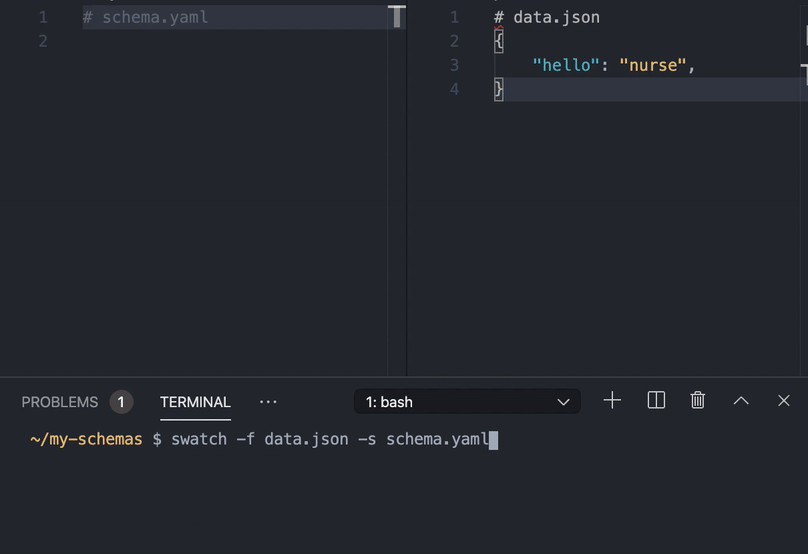

# schema-watcher (swatch)

A bare-bones command line utility that watches a schema file and a data file
and validates the data against the schema file in real time



## Installation

```sh
npm i -g schema-watcher
```

or

```sh
yarn global add schema-watcher
```

## Usage

```sh
> swatch [-h] [-v] -f FILE -s SCHEMA [-q QUERY] [-d]
```
* **`--help`** (*`-h`*): Show the help message
* **`--file`** (*`-f`*) **FILE**:  The data file to watch and validate
* **`--schema`** (*`-s`*) **SCHEMA**: Path to a schema file
* **`--query`** (*`-q`*) **QUERY**: JMESpath query to the schema if nested within a larger document
* **`-d`**: De-reference the Schema object (i.e. expand the '$ref' attributes).
    This may be required when the schema is nested within a larger document,
    but may increase memory usage and slow down validation.
